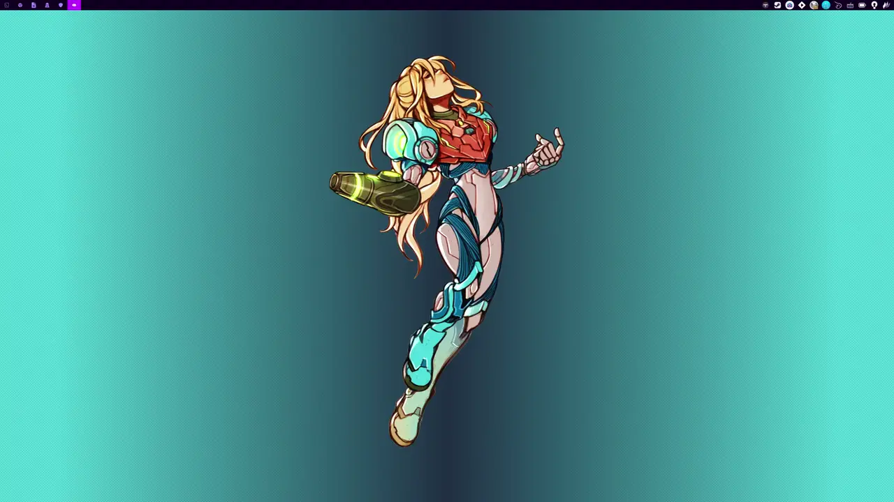
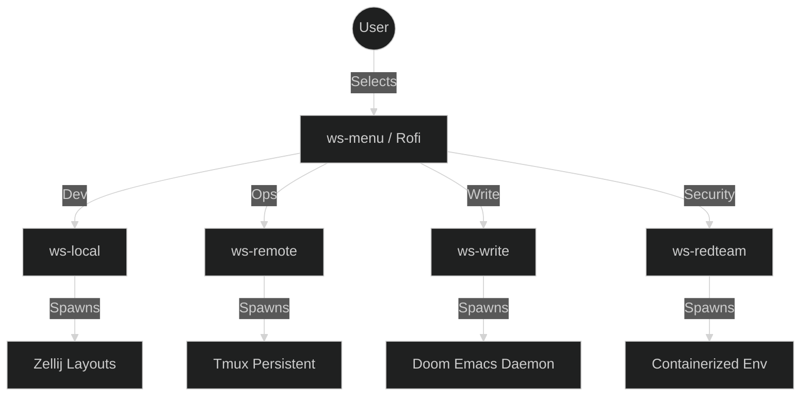
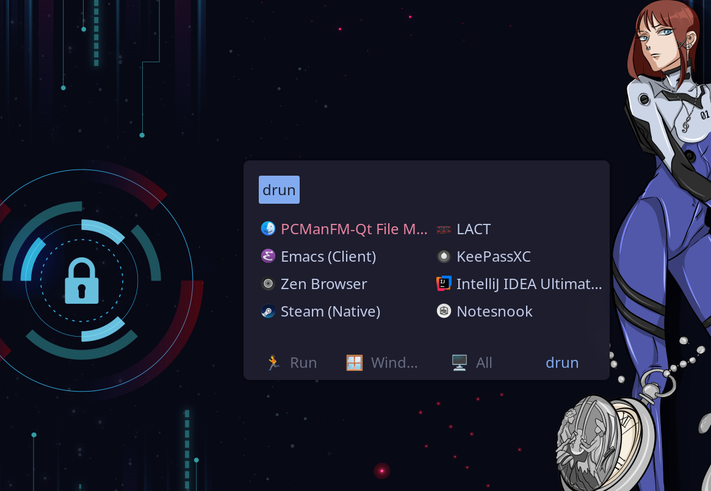

<div align="center">

<!-- Hero Banner -->


<!-- Live System Showcase - Updated DWM Configuration -->


> **🎬 Live System Preview (2026-03-17):** Current DWM configuration with Rofi launcher and Eco-Workflow setup in action.

# 🌌 Arch Linux Dotfiles S1B
[](https://git.io/typing-svg)

[](https://archlinux.org)
[](https://github.com/ind4skylivey/dotfiles-s1b)
[](LICENSE)
<br/>
[](https://dwm.suckless.org/)
[](https://zellij.dev)
[](https://github.com/doomemacs/doomemacs)
[](https://github.com/catppuccin/catppuccin)

[🚀 Quick Install](#-quick-install) • [📖 Documentation](workflow/README.md) • [🐛 Report Bug](https://github.com/ind4skylivey/dotfiles-s1b/issues)

</div>

---

> [!IMPORTANT]
> ## 🚀 Installation Options
>
> ### Option 1: Automated Installation (Recommended) ✅
> **Use [S1barch](https://github.com/ind4skylivey/s1barch)** — Complete automation system for Arch Linux + DWM
>
> S1barch is the **AUTO installer** for these dotfiles. It provides:
> - 📦 **One-command installation** — `bash <(curl -fsSL ...)`
> - 🔧 **Complete orchestration** — 88+ scripts for system setup
> - 🎯 **Hardware detection** — Auto-adapts to desktop/laptop
> - 🌐 **Eco-Workflow** — Context-aware session management
> - ✅ **Production Ready** — Working today, battle-tested
>
> ```bash
> # Install these dotfiles automatically with S1barch
> bash <(curl -fsSL https://raw.githubusercontent.com/ind4skylivey/s1barch/main/install.sh)
> ```
>
> **[⭐ Star S1barch on GitHub](https://github.com/ind4skylivey/s1barch)** • **[📖 Read Documentation](https://github.com/ind4skylivey/s1barch#readme)**
>
> ---
>
> ### Option 2: Declarative Configuration (Community Project) 🚧
> **Explore [S1bCr4ft](https://github.com/ind4skylivey/S1bCr4ft)** — Declarative system configuration framework
>
> S1bCr4ft is a **separate community project** that brings NixOS-style reproducibility to Arch Linux:
> - 📋 **YAML Configuration** — Define system in declarative files
> - 🔒 **Security-First** — GPG signing, audit trails, sandboxed hooks  
> - 🔄 **Reproducible Builds** — Same config = same system, every time
> - 🚧 **In Development** — Alpha stage, not yet production ready
>
> These dotfiles are designed as modules within the S1bCr4ft ecosystem for future integration.
>
> ```yaml
> # Future S1bCr4ft configuration (when ready)
> modules:
>   - linux-optimization/terminal-config/kitty-god-mode      # 🚀 This repo's Kitty config
>   - linux-optimization/window-manager/dwm                  # 🚀 This repo's DWM setup
> ```
>
> **[⭐ Star S1bCr4ft on GitHub](https://github.com/ind4skylivey/S1bCr4ft)** • **[📖 Read Documentation](https://github.com/ind4skylivey/S1bCr4ft#readme)**

---

## 📑 Table of Contents
- [⚡ About](#-about)
- [🧠 Eco-Workflow System](#-eco-workflow-system)
- [📸 Showcase](#-showcase)
- [📦 Included Configurations](#-included-configurations)
- [🌆 Cyberpunk Synthwave Theme](#-cyberpunk-synthwave-theme-setup) ⭐ NEW
- [🔴 Warp Terminal](#-warp-terminal---red-team--full-stack-setup) ⭐ NEW
- [🚀 Quick Install](#-quick-install)
- [🎨 Customization Guide](#-customization-guide)
- [🔧 Troubleshooting](#-troubleshooting)
- [🤝 Contributing](#-contributing)
- [📝 License](#-license)

---

## ⚡ About

**Dotfiles S1B** is more than just configuration files; it's a coherent **Operating System Layer**. Designed for developers, security researchers, and writers who need a distraction-free, keyboard-centric environment.

Built on **Arch Linux (CachyOS)**, it leverages a custom **DWM** build for window management and the **Eco-Workflow** system to orchestrate context-aware sessions.

> [!TIP]
> **Core Philosophy**
> *Minimal intrusion, maximum reproducibility. Tools should adapt to the user's intent, not the other way around.*

---

## 🧠 Eco-Workflow System

The heart of this setup is the **Orchestration Layer**. Instead of launching tools directly, you launch **Contexts**.

<div align="center">



</div>

<div align="center">

| Context | Command | Engine | Purpose |
|:---:|:---:|:---:|:---|
| **Development** | `ws-local` | **Zellij** | Coding, file management, and local testing. |
| **Infrastructure** | `ws-remote` | **Tmux** | Persistent SSH sessions and server management. |
| **Deep Work** | `ws-write` | **Emacs** | Distraction-free writing and Org-mode planning. |
| **Red Team** | `ws-redteam` | **Docker** | Isolated environments for security research/CTF. |

</div>

> [!NOTE]
> **Learn more:** Read the full [Eco-Workflow Guide](ECO_WORKFLOW_GUIDE.md).

---

## 📸 Showcase

<div align="center">

| **🚀 Application Launcher** | **💜 Doom Emacs + Yazi** |
|:---:|:---:|
|  |  |
| *Rofi with custom Catppuccin theme* | *Seamless integration for writers & devs* |

| **🔧 Tmux + Neovim** | **⚡ Zellij Workspace** |
|:---:|:---:|
|  |  |
| *Classic robust multiplexing* | *Modern, layout-driven workflows* |

</div>

### 🎨 Waybar + ArchyNotch - KDE Plasma Multi-Monitor Setup

<div align="center">


*Professional cyberpunk status bar with independent wallpaper management per monitor*

**Powered by:** [ArchyNotch](https://github.com/ind4skylivey/archynotch) - Arch Linux notification daemon & desktop tools integration

</div>

**Key Features:**
- ✅ **Multi-Monitor Support** - Separate configurations for 3 monitors (DP-1, DP-2, HDMI-A-1)
- ✅ **12 System Modules** - CPU, Memory, Temp, Network, VPN, Uptime, PulseAudio, Clock, Git status
- ✅ **Dynamic Wallpapers** - Independent random/next/prev per monitor using `swww`
- ✅ **Virtual Desktop Indicator** - 4 spaces with visual feedback (⬤ = active, ○ = inactive)
- ✅ **Quick App Launcher** - Zen Browser, PhpStorm, Zed IDE, Steam with single click
- ✅ **Git Integration** - Active branch display in window title
- ✅ **Wofi Integration** - Cyberpunk-themed application launcher

**ArchyNotch Integration:**
The [ArchyNotch](https://github.com/ind4skylivey/archynotch) notification daemon seamlessly integrates with waybar to provide system notifications, desktop alerts, and event handling for:
- Calendar popups (click clock)
- VPN/Network status updates
- Temperature warnings
- Volume control feedback
- Git branch notifications

[Full Waybar Documentation](.config/waybar/README.md) • [ArchyNotch Repository](https://github.com/ind4skylivey/archynotch)

---

## 📦 Included Configurations

A curated suite of modern, high-performance tools aimed at speed and aesthetics.

<div align="center">

| **Shell & Terminal** | **Window Management** | **Editors** | **Utilities** |
| :--- | :--- | :--- | :--- |
| 🐟 **Fish** <br> *(Interactive Shell)* | 🪟 **DWM** <br> *(Patched & Rice)* | 📝 **Neovim** <br> *(Lua Config)* | 💎 **[Prism Terminal](https://github.com/ind4skylivey/iridex-prism-terminal)** <br> *(Persona Prompt)* |
| 🐚 **Zsh** <br> *(Posix Compliant)* | 🎨 **Picom** <br> *(Compositor)* | 💜 **Doom Emacs** <br> *(Org-Mode)* | 📂 **Yazi** <br> *(File Manager)* |
| 🐱 **Kitty** <br> *(GPU Terminal)* | 🚦 **Rofi** <br> *(Launcher)* | ⚡ **Helix** <br> *(Modal Editor)* | 🦀 **[GleamObserver](https://github.com/ind4skylivey/Gleam-Observer)** <br> *(Process Monitor)* |
| ⚡ **Alacritty** <br> *(Fast Terminal)* | 🔔 **Dunst** <br> *(Notifications)* | 📜 **Micro** <br> *(Simple Editor)* | ⏱️ **[MatteriaTrack](https://github.com/ind4skylivey/matteria-track)** <br> *(Time Tracker)* |

</div>

#### Helix Red-Team Profile (power + neon)
- Config lives in `.config/helix` (in this repo). Apply with your dotfiles workflow (stow/chezmoi/bootstrap).
- Theme: `:theme il1v3y_cyberpunk` (red-team neon with violet accents).
- Reload without restart: `:config-reload`.
- Leader cheats: `space B` (git blame current line), `space /` (global search), `space d` (diagnostics), `Ctrl-w s|v` splits, `Ctrl-w H/J/K/L` swaps panes.
- Trim/format on save is enabled; if a formatter is missing, Helix will log it—install the formatter or toggle `auto-format`.

---

## 🌆 Cyberpunk Synthwave Theme Setup

A complete **unified cyberpunk aesthetic** for your development environment with neon magenta, cyan, and dark purple colors.

### 🎨 What's Included

| Component | Status | Guide |
|-----------|--------|-------|
| **Kitty Terminal** | ✅ Complete | [📋 CHEATSHEET.md](.config/kitty/CHEATSHEET.md) - God Mode with 50+ keybindings, hints & kittens |
| **Alacritty Terminal** | ✅ Complete | [📋 CHEATSHEET.md](.config/alacritty/CHEATSHEET.md) - God Mode configuration |
| **Zen Browser** | ✅ Complete | [📖 ZEN_BROWSER_GUIDE.md](ZEN_BROWSER_GUIDE.md) - Matching browser theme |
| **Tmux/Zellij** | ✅ Optional | [📖 tmux-zellij-integration.conf](.config/kitty/tmux-zellij-integration.conf) - Integration guide |
| **Overview** | ✅ Complete | [📖 CYBERPUNK_SETUP.md](CYBERPUNK_SETUP.md) - Complete setup walkthrough |

### 🎯 Quick Features

**Kitty Terminal:**
- 50+ professional keybindings (development, security, sysadmin tools)
- Neon magenta & cyan color scheme
- Performance-optimized rendering
- Tmux & Zellij compatible
- **God Mode Features**: Hints system (11 pattern types), 100k scrollback, 12 kittens
- [📋 Cheat Sheet](.config/kitty/CHEATSHEET.md) - Complete reference guide

**Alacritty Terminal:**
- Alternative GPU-accelerated terminal
- Vi Mode complete with full navigation
- Hints system for URLs, IPs, hashes, paths
- 100,000 lines scrollback
- [📋 Cheat Sheet](.config/alacritty/CHEATSHEET.md) - God Mode configuration

**Zen Browser:**
- Matching cyberpunk synthwave theme
- Bright purple sidebar
- Neon magenta tabs & cyan borders
- Smooth animations & glow effects

**Color Palette:**
```
🟣 Background:     #0d1b2a  (Deep purple-blue)
💜 Primary:        #FF10F0  (Magenta neon)
🔵 Secondary:      #00d9ff  (Cyan neon)
🟣 Accents:        #8B5CF6  (Bright purple)
```

### 🚀 Quick Start

**Install Kitty + Zen theme:**
```bash
# Kitty
cp .config/kitty/kitty.conf ~/.config/kitty/
cp .config/kitty/cyberpunk-synthwave.conf ~/.config/kitty/

# Zen Browser (find your profile in ~/.zen/)
cp .zen-browser-config/* ~/.zen/YOUR_PROFILE_NAME/
```

> [!TIP]
> **Want to keep your personal Tmux/Zellij config?** The Tmux/Zellij integration is completely optional! Read [tmux-zellij-integration.conf](.config/kitty/tmux-zellij-integration.conf) for optional recommendations only.

### 📚 Documentation

- **[CYBERPUNK_SETUP.md](CYBERPUNK_SETUP.md)** - Complete overview, color palette, workflow integration
- **[KITTY_GUIDE.md](KITTY_GUIDE.md)** - Detailed Kitty documentation with 50+ keybindings reference
- **[ZEN_BROWSER_GUIDE.md](ZEN_BROWSER_GUIDE.md)** - Browser theme customization and integration
- **[.config/kitty/tmux-zellij-integration.conf](.config/kitty/tmux-zellij-integration.conf)** - Optional Tmux/Zellij integration guide

---

## 🔴 Warp Terminal - Red Team & Full Stack Setup

A **complete offensive security terminal** environment optimized for red team operations, exploit development, and full stack development.

### ⚡ What's Included

<div align="center">

| **Themes** | **Aliases** | **Keybindings** | **Documentation** |
|:---:|:---:|:---:|:---:|
| 🎨 **12 Cyberpunk Themes** | 🔐 **40+ Security Aliases** | ⌨️ **Split-Pane Workflow** | 📖 **Complete Guides** |
| Red Team, Blue Team, CTF Mode | Red team operations | Ctrl+Shift+D / E | WARP_SETUP.md |
| Cyberpunk Violet, Pastel | Exploit development | Ctrl+P (Command Palette) | QUICK-REFERENCE.md |
| Debug, Production, Late Night | Malware analysis | Ctrl+R (History) | WORKFLOW-OPTIMIZATION.md |
| Code Review, Hyperfocus | Full stack dev | Ctrl+Shift+F (Search) | ALIASES.zsh |

</div>

### 🎯 Features at a Glance

```
┌─ Red Team Operations ────────────────────────────────────────┐
│  recon, stealth-scan, full-enum, burp, web-scan, sqlmap    │
├─ Exploit Development ───────────────────────────────────────┤
│  pattern-gen, shellcode-gen, rop-search, gdb-debug         │
├─ Malware Analysis ──────────────────────────────────────────┤
│  ghidra, strings-hunt, bin-analyze, strace-monitor, ltrace │
├─ Full Stack Development ────────────────────────────────────┤
│  php-server, rust-check, rust-build, py-serve, npm-dev     │
├─ Security & Git ────────────────────────────────────────────┤
│  scan-commit, safe-commit, scan-leaks, check-diffs          │
└─────────────────────────────────────────────────────────────┘
```

### 🎨 Themes Preview

#### 🔴 Offensive Security Themes

| Theme | Accent | Background | Best For |
|:---|:---:|:---:|:---|
| 🔴 **Red Team** | `#ff0a0a` | `#0a0000` | Red team operations, active attacks |
| 🔵 **Blue Team** | `#00d4ff` | `#0a1a2a` | DFIR, security operations |
| 🏆 **CTF Mode** | `#00ff80` | `#0a0a0a` | CTF competitions, max contrast |
| 🚀 **Production** | `#059669` | `#0c1a14` | Production deployments |

#### 💻 Development Themes

| Theme | Accent | Background | Best For |
|:---|:---:|:---:|:---|
| 💜 **Cyberpunk Violet** | `#9d4edd` | `#1a0b2e` | Full stack development |
| 🌸 **Cyberpunk Pastel** | `#ff80ff` | `#2a1a35` | General development |
| 👁️ **Code Review** | `#50a0ff` | `#1c1e26` | Code reviews, reading |

#### 🌙 Specialized Workflows

| Theme | Accent | Background | Best For |
|:---|:---:|:---:|:---|
| 🌙 **Late Night** | `#d4a574` | `#1a1814` | Late night coding |
| 🐛 **Debug Mode** | `#ffcc00` | `#1a1a00` | Debugging sessions |
| ⚡ **Hyperfocus** | `#64748b` | `#0f172a` | Deep work, focus |

#### 📋 Communication Themes

| Theme | Accent | Background | Best For |
|:---|:---:|:---:|:---|
| 🎤 **Presentation** | `#2563eb` | `#0f172a` | Demos, client meetings |
| 📝 **Documentation** | `#d67bb6` | `#fdf0f5` | Writing docs (light mode) |

### 🔑 Essential Keybindings

```bash
╔════════════════════════════════════════════════════════════╗
║              PANE MANAGEMENT (Split Workflow)              ║
╠════════════════════════════════════════════════════════════╣
║  Ctrl+Shift+D  → Split Right    Ctrl+Shift+→ → Navigate   ║
║  Ctrl+Shift+E  → Split Down     Ctrl+Shift+← → Navigate   ║
║                                                            ║
║              COMMAND & SEARCH (Rapid Access)              ║
╠════════════════════════════════════════════════════════════╣
║  Ctrl+P        → Command Palette                           ║
║  Ctrl+R        → Search History                            ║
║  Ctrl+Shift+F  → Full Output Search                        ║
║                                                            ║
║              TABS (Context Switching)                      ║
╠════════════════════════════════════════════════════════════╣
║  Ctrl+Shift+T  → New Tab        Ctrl+Tab → Next Tab       ║
║  Ctrl+Shift+W  → Close Tab      Ctrl+Shift+Tab → Prev     ║
╚════════════════════════════════════════════════════════════╝
```

### 🚀 Quick Start

**Clone and Link Warp Config:**
```bash
cd ~/dotfiles-s1b
cp .config/warp-terminal ~/.config/
cp -r .local/share/warp-terminal/themes ~/.local/share/warp-terminal/
```

**Or Source Aliases:**
```bash
source ~/.config/warp-terminal/ALIASES.zsh >> ~/.zshrc
source ~/.zshrc
```

**Test the Setup:**
```bash
# Try an alias
recon 192.168.1.0/24

# Test split panes
# Ctrl+Shift+D (split right) then Ctrl+Shift+E (split down)

# Generate exploit pattern
pattern-gen

# Launch security tools
burp
ghidra
```

### 📂 File Structure

```
themes/
├── red_team/                        # 🔴 Red Team Operations
├── blue_team/                       # 🔵 Blue Team / DFIR
├── ctf_mode/                        # 🏆 CTF Competitions
├── production/                      # 🚀 Production Deploy
├── cyberpunk_violet/                # 💜 Full Stack Dev
├── cyberpunk_pastel/                # 🌸 General Development
├── code_review/                     # 👁️ Code Reviews
├── late_night/                      # 🌙 Late Night Coding
├── debug_mode/                      # 🐛 Debug Sessions
├── hyperfocus/                      # ⚡ Deep Work
├── presentation/                    # 🎤 Demos & Meetings
└── documentation/                   # 📝 Writing Docs (light mode)
```

### 🚀 Installation

**Clone and Install Themes:**
```bash
cd ~/dotfiles-s1b

# Linux
mkdir -p ~/.local/share/warp-terminal/themes
cp -r themes/* ~/.local/share/warp-terminal/themes/

# macOS
mkdir -p ~/.warp/themes
cp -r themes/* ~/.warp/themes/
```

**Reload Warp:**
1. Close Warp completely
2. Reopen Warp
3. Go to **Settings → Appearance → Current Theme**
4. Select your theme from **Custom Themes**

### 💡 Quick Theme Switching

Use Command Palette (**Ctrl+P**) and type `themes`:

```bash
Red Team Op → Red Team
Pentest → Blue Team
CTF → CTF Mode
Dev → Cyberpunk Violet
Late Night → Late Night
Debug → Debug Mode
Deploy → Production
```

### 💡 Example Workflows

**Penetration Testing Setup:**
```bash
# Pane 1: Reconnaissance
recon 192.168.1.0/24

# Pane 2: Burp Suite (Ctrl+Shift+Right → Ctrl+Shift+D)
burp

# Pane 3: Exploitation prep
cd ~/security/exploits && ls -la
```

**Exploit Development:**
```bash
# Pane 1: Generate pattern
pattern-gen > pattern.txt

# Pane 2: Debug target
gdb-debug ./vulnerable_binary

# Pane 3: Monitor system calls
strace-monitor ./vulnerable_binary
```

**Full Stack Development:**
```bash
# Pane 1: Code editor
code .

# Pane 2: Build & test
cargo watch -x "check --color always"

# Pane 3: Server logs
npm run dev
```

### 📚 Complete Documentation

- **[WARP_SETUP.md](.config/warp-terminal/WARP_SETUP.md)** - Installation, themes, customization
- **[QUICK-REFERENCE.md](.config/warp-terminal/QUICK-REFERENCE.md)** - Command reference & shortcuts
- **[WORKFLOW-OPTIMIZATION.md](.config/warp-terminal/WORKFLOW-OPTIMIZATION.md)** - Advanced setup & integration
- **[ALIASES.zsh](.config/warp-terminal/ALIASES.zsh)** - Standalone alias configuration

### 🎯 Specifications

| Property | Details |
|----------|---------|
| **Themes Available** | 12 cyberpunk themes for different workflows |
| **Default Theme** | Red Team (aggressive red on black) |
| **Aliases** | 40+ for red team, exploit dev, malware analysis, dev |
| **Keybindings** | Optimized for split-pane workflow |
| **Container Support** | Malware analysis labs (podman/docker integration) |
| **Shell Integration** | Zsh, Fish, Bash compatible |
| **Git Security** | Secret scanning on commits |
| **Agent Mode** | Warp AI assistance for rapid exploitation/setup |
| **Theme Categories** | Offensive Security, Development, Specialized, Communication |

> [!TIP]
> **Pro Tip:** Use `scan-commit` alias before every git commit to automatically detect secrets, API keys, and sensitive data.

---

## 🚀 Quick Install

> [!CAUTION]
> **Security Notice:** Always inspect remote scripts before running them.
> [View Source](https://github.com/ind4skylivey/dotfiles-s1b/blob/main/bootstrap.sh)

**One-Liner (Arch Linux):**
```bash
bash <(curl -fsSL https://raw.githubusercontent.com/ind4skylivey/dotfiles-s1b/main/bootstrap.sh)
```

**Alternative (Git Clone):**
```bash
git clone https://github.com/ind4skylivey/dotfiles-s1b.git ~/dotfiles
cd ~/dotfiles
./install.sh
```

**Post-Install Checklist:**
- [ ] Run `./lockscreen-setup.sh` to set up wallpapers.
- [ ] Log out and log back in to DWM.
- [ ] Run `ws-doctor` to verify the ecosystem health.

---

## 🎨 Customization Guide

Make it yours in 4 simple steps:

1.  **Themes:** Edit `~/.config/alacritty/alacritty.toml` or `~/.config/kitty/kitty.conf` to swap color schemes (Nord, Catppuccin, etc. included).
2.  **Shell:** Choose your fighter. `chsh -s /bin/fish` for interactivity or `/bin/zsh` for stability.
3.  **Window Manager:** Modify `~/.config/dwm/config.h` and run `sudo make install` inside the directory to apply patches.
4.  **Workflows:** Tweak layouts in `~/dotfiles/workflow/zellij/layouts/` to match your screen size and habits.

---

## 🔧 Troubleshooting

<details>
<summary><b>Common Issues (Click to expand)</b></summary>

| Issue | Solution |
| :--- | :--- |
| **Shell Plugins missing** | Run `fisher update` (Fish) or delete `~/.cache/zsh` and restart (Zsh). |
| **DWM compilation error** | Ensure `base-devel`, `libx11`, `libxft`, `libxinerama` are installed. Clean build with `make clean install`. |
| **Tmux plugins inactive** | Press `Prefix + I` (Capital I) inside Tmux to fetch plugins. |
| **Doom Emacs Sync** | Run `~/.config/emacs/bin/doom sync` to refresh packages. |

</details>

---

## 🤝 Contributing

Contributions are welcome!
1.  Fork the project.
2.  Create your feature branch (`git checkout -b feature/AmazingFeature`).
3.  Commit your changes (`git commit -m 'Add some AmazingFeature'`).
4.  Push to the branch (`git push origin feature/AmazingFeature`).
5.  Open a Pull Request.

---


## 📝 License

Distributed under the MIT License. See `LICENSE` for more information.

<br>
<div align="center">
  
  <br>
  <sub>Built with ❤️ by <a href="https://github.com/ind4skylivey">ind4skylivey</a></sub>
</div>
