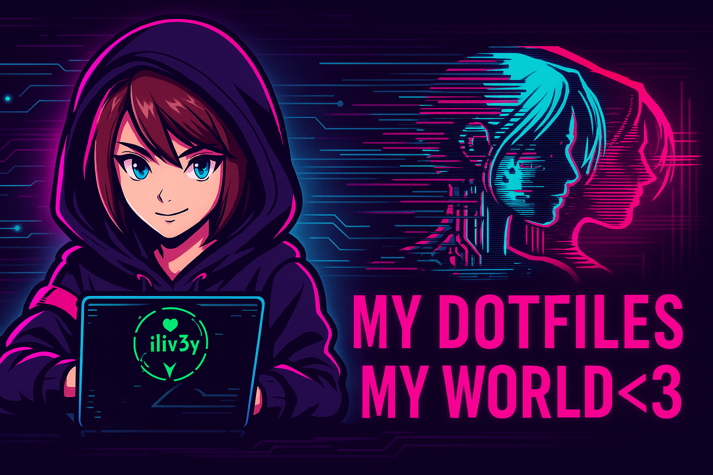
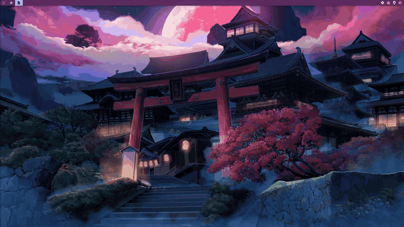
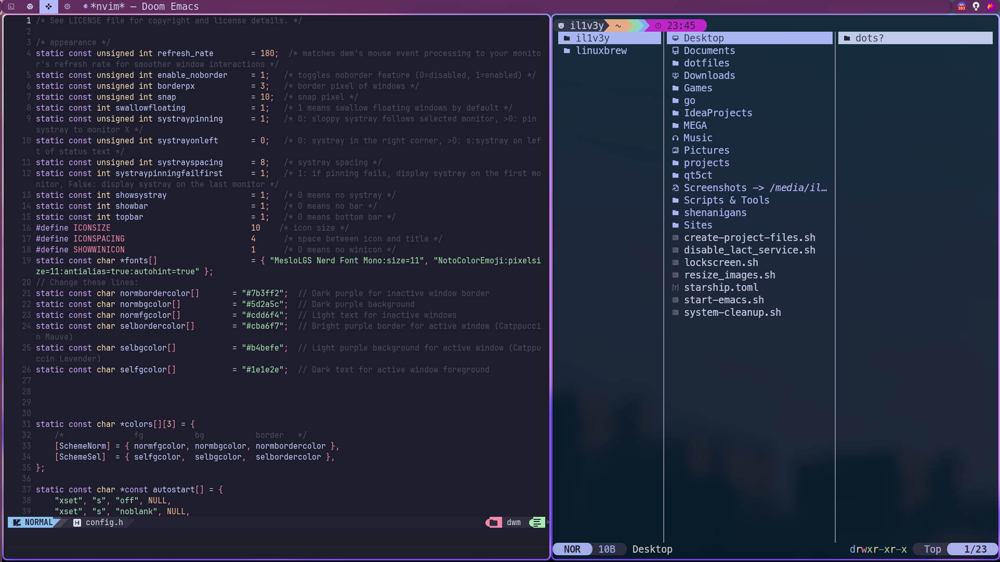
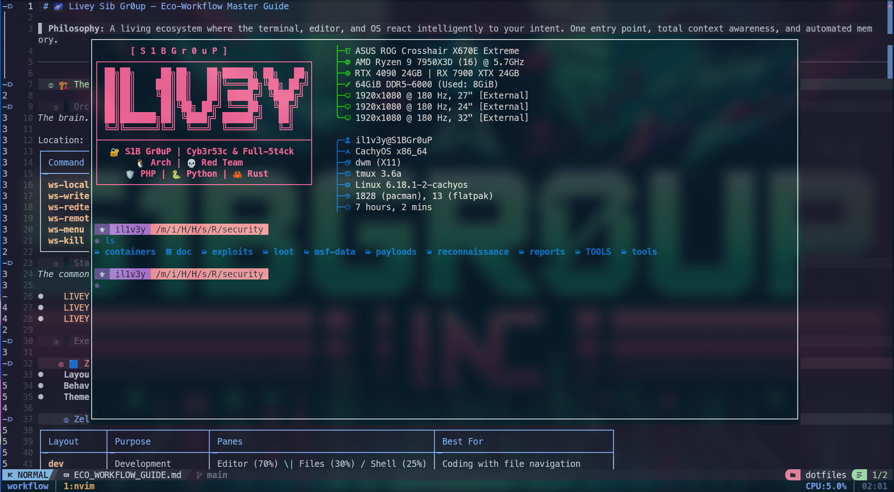
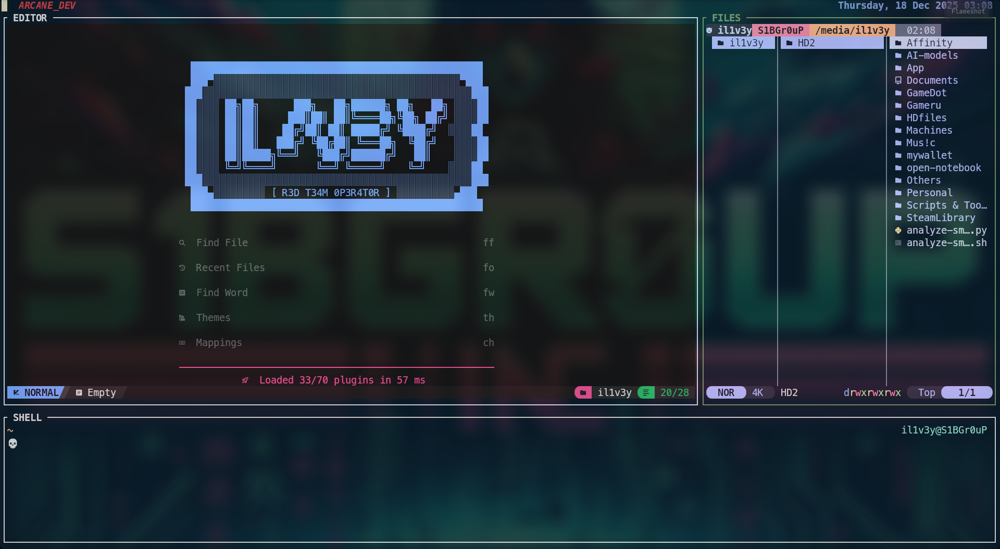
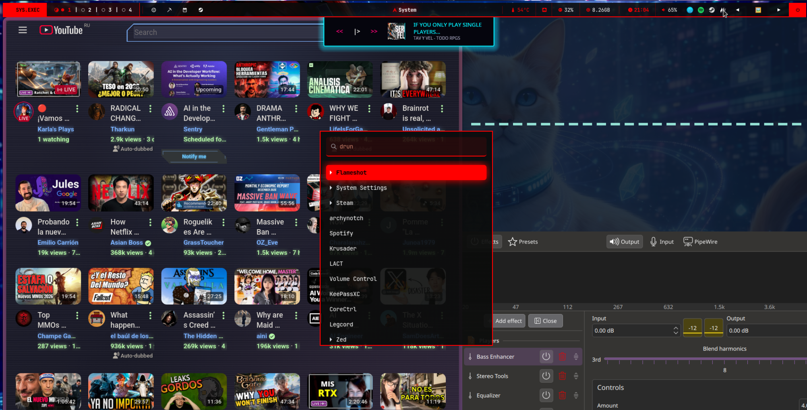

# Arch Linux Dotfiles - S1B



### Live System Showcase



---

[](https://archlinux.org)
[](https://dwm.suckless.org)
[](https://nvchad.com)
[](https://zellij.dev)
[](https://doomemacs.org)
[](https://fishshell.com)
[](https://catppuccin.com)
[](LICENSE)

---

## What is this?

A **declarative, modular, idempotent** configuration platform for Unix/Linux, with Arch/CachyOS as Tier 1. The git tree still contains a single-host dump under `.config/`, `bin/`, and `workflow/`. New installs are **not** that dump: they go through portable modules, a dry-run plan, copy-only backups, and a per-path linker (not GNU Stow).

Daily Wayland session: **Niri** + Noctalia (config upstream: [NiriPURA](https://github.com/ind4skylivey/NiriPURA.git)). DWM is X11. Waybar is **Plasma only**. Never two compositors.

Cyberpunk / Catppuccin aesthetics are an **optional** `--profile full` layer. CLI profiles work without a window manager.

Approved architecture: [docs/architecture.md](docs/architecture.md). Audit of the dump: [docs/audit/current-state.md](docs/audit/current-state.md).

---

## CLI (writes nothing unless you link)

```bash
git clone git@github.com:ind4skylivey/dotfiles-s1b.git
cd dotfiles-s1b
./install.sh --help
./install.sh --dry-run
./install.sh --dry-run --profile minimal
./install.sh --dry-run --profile workstation
./install.sh --dry-run --profile desktop          # Niri (Wayland)
./install.sh --dry-run --desktop dwm              # X11
./install.sh --dry-run --desktop plasma           # Waybar
./install.sh --dry-run --profile security         # opt-in + [warn]
./install.sh --dry-run --profile gaming
./install.sh --dry-run --profile full             # themes + userChrome; not security
./install.sh --doctor
./validate.sh
bash tests/run.sh
```

`--profile` / `--desktop` without `--dry-run` still exit **3** (plan only; no live `~/.config` links yet).

`./install.sh` with **no flags** (or `--legacy`) runs the old Arch/stow installer. Do **not** point that at a live home: it can `rm -rf` `~/.config/*`.

Per-path symlink (after a backup): `./install.sh --link SRC DEST` — see [docs/linker.md](docs/linker.md).

---

## Profiles

| Profile | Plans | Does not plan |
|---|---|---|
| `minimal` | portable zsh/fish, git (no identity), small nvim | terminals, mux, desktop, security, gaming, themes |
| `workstation` | minimal + kitty/alacritty + tmux/zellij | DWM, Niri, security, gaming |
| `developer` | same portable CLI as workstation | red team, compositors |
| `desktop` | one backend (`niri` default) | the other compositors; Waybar unless `plasma` |
| `security` | `[warn]` + Burp/ZAP overlay | dump `kali --privileged` |
| `gaming` | MangoHud | shell, Plasma steam-launch |
| `full` | CLI + gaming + GTK theme + Zen `userChrome` | security (must be explicit) |

Git identity: copy `modules/git/local.example` → `~/.config/git/local`. Never commit email or signing keys.

Browser: live **Zen** (stability/security profile on disk), plus **Helium** and **Qutebrowser** with their own system configs. This repo does **not** replace those. `--profile full` only stages an old `userChrome.css` under `.zen-browser-config/chrome/` (optional theme archive). Never `prefs.js`.

---

## Desktop backends (mutually exclusive)

| Flag | Session | Bar | Source |
|---|---|---|---|
| `--desktop niri` | Wayland (default) | Noctalia + Fuzzel, **no Waybar** | portable KDL from NiriPURA |
| `--desktop dwm` | X11 | slstatus + picom | `modules/dwm` xinitrc; dump C sources stay in `.config/dwm/` |
| `--desktop plasma` | KDE Wayland | Waybar | generic bar, not `config-dp1.jsonc` |

Host monitors, OpenRGB, and `/home/…` paths stay in overlays, not the portable Niri module.

---

## Modules

Portable files live under `modules/*/home/`. The dump is **not** copied into those trees.

| Module | Docs |
|---|---|
| shell, git, editor | [shell](docs/modules/shell.md), [git](docs/modules/git.md), [editor](docs/modules/editor.md) |
| terminal, mux | [terminal](docs/modules/terminal.md), [mux](docs/modules/mux.md) |
| niri, dwm, waybar | [niri](docs/modules/niri.md), [dwm](docs/modules/dwm.md), [waybar](docs/modules/waybar.md) |
| security, gaming, themes, browser | [security](docs/modules/security.md), [gaming](docs/modules/gaming.md), [themes](docs/modules/themes.md), [browser](docs/modules/browser.md) |

CI: `.github/workflows/validate.yml` (`actions/checkout@v5`, ShellCheck, tests, secret scan of `modules/` and `scripts/` only). Advisory PR labels: `.github/workflows/jev-pr-label.yml` (see [docs/jev-pr-label.md](docs/jev-pr-label.md)).

---

## Screenshots

### Doom Emacs



Seamless editor + file browser integration with Catppuccin theme.

### Tmux + Zellij

|  |  |
|:---:|:---:|
| Classic, rock-solid multiplexing | Modern layout-driven approach |

### Waybar Multi-Monitor



Three monitors with independent wallpaper management and a cyberpunk status bar. Tracks CPU, memory, temp, network, VPN and more.

---

## Still in the dump (not the default plan)

`.config/`, `bin/ws-*`, `workflow/`, `.doom.d/`, NvChad, Eco-Workflow guides, and Warp aliases stay in git until they migrate. They are **not** what `--dry-run --profile minimal` links.

Legacy workflow docs: [ECO_WORKFLOW_GUIDE.md](ECO_WORKFLOW_GUIDE.md), [workflow/README.md](workflow/README.md). Dump DWM/Waybar/nvim notes remain under `.config/`.

---

## Personal projects

- [iridex-prism-terminal](https://github.com/ind4skylivey/iridex-prism-terminal)
- [Gleam-Observer](https://github.com/ind4skylivey/Gleam-Observer)
- [matteria-track](https://github.com/ind4skylivey/matteria-track)
- [archynotch](https://github.com/ind4skylivey/archynotch)
- [NiriPURA](https://github.com/ind4skylivey/NiriPURA.git) — live Niri config (sibling repo)

---

## Themes (optional)

`--profile full` plans a small GTK overlay and an optional Zen **userChrome** staging file. That is not the live Zen profile (which stays on the machine for stability). Helium and Qutebrowser configs stay on-system. Do not copy dump `prefs.js`.

Heavy Kvantum / qt5ct palettes and cyberpunk Kitty includes stay in the dump until you opt in.

---

## License

MIT. See [LICENSE](LICENSE).

Questions: [open an issue](https://github.com/ind4skylivey/dotfiles-s1b/issues).
